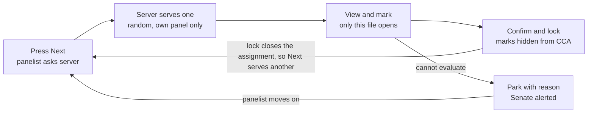
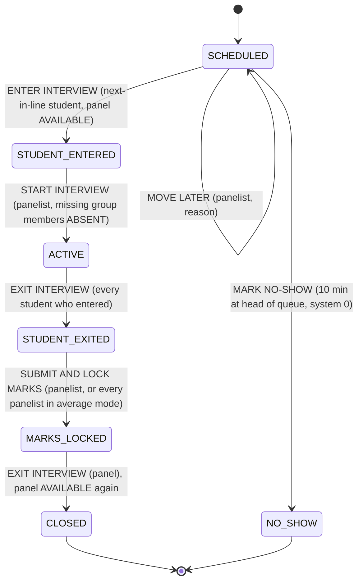

# Calvin 2.0 — Evaluation Non-Negotiables & Execution Plan

Snapshot of the Claude doc as of 29 Sep 2026. The live doc is the source of truth for product decisions: https://claude.ai/code/artifact/d8be380f-774d-42ec-87a2-6b123addf110 (private until shared). If a decision changes there, update this file before building against it.

Both non-negotiables become backend state machines. The task queue shows each panelist one submission and serves the next only after its marks lock. The interview session admits only the next student in the panel's schedule, and it holds the panel until the panel exits after locking marks. Decisions D1–D14 and N1–N7 are applied throughout; N8 is still open. We build in 12 loops (0–11). A loop closes only when the full regression gate passes: every earlier loop's tests and invariants, not just the new ones.

## What the PRDs settle

Your description and the PRD agree on the core. Three details differ, and the PRD wins because you asked me to check it. Section numbers refer to the Production Document; "Gaps" is the corrected gaps note.

| Point | Your description | What the PRD says | Rule we build |
| --- | --- | --- | --- |
| Who enters first | Panel taps in, then the student | §27 Step 1: student enters; Step 2: panel enters. ACTIVE only when both are in (§17) | Student taps ENTER INTERVIEW first; panel taps START INTERVIEW second |
| Marks vs panel exit | Panel taps out, then gives marks | §24: the exit option is unavailable until marks are submitted and locked | Student exits → panel enters marks → lock → panel exits |
| Next candidate | Next in line per the panel's schedule; panel can move an unavailable student (D4) | §25–26: panel stays BUSY until it exits; opening another student is rejected | Only the session at the head of the panel's queue can be entered, and only while the panel is AVAILABLE |
| Who evaluates | Every committee member can be a panelist; applicants are juniors and never evaluate (D3) | Every mark names its evaluator (§21, §42); panelists see only their own panel's students (BR-08) | Individual panelist logins for CCA members; the database refuses any junior as a panelist |
| Task evaluation order | One submission at a time; mark before the next is shown | Not specified. PRD gives lock + hide (§21–23) and panel-only evaluation (BR-08) | New rule set NN-T: the server serves one submission per panelist; the next only after lock |
| Multi-member panels | Not covered | Gaps: the CCA picks per round, one combined score or each member scores and the average counts | A per-round scoring mode. It changes how both queues work |
| When an interview counts as done | Not covered | §18 (older) needs student and panel "completed"; §16–32 is marked as replacing it | §16–32 is authoritative: done = panel exited after marks locked |

The PRD's central requirement (§32) shapes everything below: every restriction lives in the backend. Hiding a button is never the control; the API refuses the action even when called directly.

## Non-negotiable A — Task evaluation, one submission at a time

The server, not the screen, decides what a panelist sees: exactly one submission, and the next only after that submission's marks are locked. Panelists get no list, search, preview or skip.

**Submission (student side)**

1. **NN-T1 Storage.** The student uploads during the round's submission window. The server stores the file outside any public folder, with a database timestamp, SHA-256 hash, size and type. Allowed types and size limit are fixed per round when the structure is finalized.
2. **NN-T2 Upload is the submission.** There is no separate draft-then-confirm step, so no student loses a round by forgetting to click Submit. Re-uploads create new versions. Every version is kept, and the latest one before the hard close is evaluated. Statuses: Not Started → In Progress (upload in transit) → Submitted (before the due time) → Late Submitted (after the due time, before the hard close) → Closed.
3. **NN-T3 Due time and hard close (D5).** Each task round has a due time and a hard close. Uploads between the two are accepted and flagged Late Submitted to Senate. The CCA may move the hard close later, even after the due time has passed, until it presses Start evaluation. It can never move the hard close earlier. Every change is audited, and every student in the round is notified.
4. **NN-T4 Freeze.** Evaluation begins only after two things: the hard close has passed, and the CCA has pressed Start evaluation. That press freezes the round, so no more uploads and no more hard-close changes. Students with no upload get a system-recorded 0 marked "absent" (D6), never a panelist entry.

**Evaluation (panel side)**

5. **NN-T5 Pool.** A panelist's pool is the submissions of students assigned to their panel for this round (BR-08). Only members of the CCA can sit on its panels, and juniors can never be panelists (D3).
6. **NN-T6 Serve one.** "Next" is a server call. It returns the panelist's open assignment if one exists. Otherwise it atomically assigns one not-yet-evaluated submission from the pool.
7. **NN-T7 Server-chosen order.** Order is random, seeded per round, and the seed is written to the audit log. Panelists cannot choose or reorder.
8. **NN-T8 File access follows the assignment.** The file endpoint streams a submission only to four parties: its own student; the panelist it is currently assigned to; the panel of an ACTIVE interview session (Task + Interview rounds); and Senate. There are no public or guessable URLs, and every file open is logged.
9. **NN-T9 Lock releases the next.** Marks go Enter → Review → Confirm & Lock. Every mark is a whole number from 0 to the maximum (D12). Locking is a single database write that does three things: stores the marks as LOCKED, closes the assignment, and hides the marks from the CCA. Only then can "Next" serve another submission.
10. **NN-T10 Scoring mode (per round, from Gaps).**
    - *Single score:* one shared queue per panel with at most one open assignment. Any panelist may lock it, and their identity is recorded.
    - *Average:* each panelist has an independent queue with one open assignment each. The student's round score exists only after every panelist has locked, and it is the system-computed average, kept exact and never rounded (N2).
11. **NN-T11 Scored parameters.** If the round defines parameters (e.g. Communication 10, Content 10, Fit 10), each gets a whole number and is range-checked. The component score is their system-computed sum. Qualitative guidance, if given, is shown beside the form.
12. **NN-T12 Group tasks (D14).** The CCA forms groups after the previous round's elimination and before this round opens. Groups freeze when the round opens.
    - A group makes one submission, which any member may upload.
    - The queue unit is the group. The form lists every member and needs an individual mark for each (N/N).
    - A member who has withdrawn can only receive 0 from the panelist; the server rejects anything else.
    - A group with no submission gets a system 0 for every member.
13. **NN-T13 No silent skipping.** A panelist who cannot evaluate a submission (corrupt file, conflict of interest) raises an exception with a reason. The submission is parked for Senate and the panelist moves to the next one. Every park is audited and raises an orange alert; a third park by one panelist in a round raises a red alert.
14. **NN-T14 Stale assignments.** An assignment left open for more than 60 minutes (configurable) raises a Senate warning. It is never released automatically, because automatic release would allow peek-then-skip.
15. **NN-T15 Screening (Round 0) task.** The same queue applies, but the decision is Promoted / Eliminated with no marks field. Elimination requires a one-line reason. With a multi-member panel, elimination needs a majority (2 of 3); a tie retains the student.

Pressing Next while an assignment is open returns that same submission. When the pool is empty, Next answers "All evaluated" and the round can move to close.

## Non-negotiable B — Interview session

An interview is a server-side session. Only the next student in the panel's schedule can open it. It holds the panel from that entry until the panel exits after locking marks. No screen can skip a step, because the API refuses the step.

| # | From state | Button | Who may press it | Server checks | To state |
| --- | --- | --- | --- | --- | --- |
| 1 | SCHEDULED | ENTER INTERVIEW | The student(s) of the session at the head of the panel's queue | Session is next in the panel's schedule; panel AVAILABLE; round ACTIVE; student is in no other open interview in any CCA | STUDENT\_ENTERED; panel BUSY |
| 2 | STUDENT\_ENTERED | START INTERVIEW | A panelist of this panel | At least one student of the session has entered. Group members not yet inside are recorded ABSENT | ACTIVE |
| 3 | ACTIVE | EXIT INTERVIEW | Each student who entered | Student is inside this session | STUDENT\_EXITED once every entered student has exited; evaluation unlocks |
| 4 | STUDENT\_EXITED | SUBMIT & LOCK MARKS | A panelist (every panelist in average mode) | A whole-number mark for every student on the session (N/N); ABSENT or withdrawn members may only get 0; every mark within 0–max; this panelist has not already locked | MARKS\_LOCKED once all required scores are locked |
| 5 | MARKS\_LOCKED | EXIT INTERVIEW (panel) | A panelist | None | CLOSED; panel AVAILABLE; the next session in the queue can now be entered |
| 6 | SCHEDULED | MOVE LATER | A panelist of this panel | Session not started; reason given | SCHEDULED at a later place in the queue |
| 7 | SCHEDULED | MARK NO-SHOW | A panelist of this panel | Session has sat at the head of the queue, with the panel AVAILABLE, for 10 minutes (configurable) without an ENTER; reason given | NO\_SHOW: system records 0 "absent" (D6); Senate may reverse and reschedule until the round's evaluation locks |
| 8 | Any open state | RAISE EXCEPTION | A panelist or the CCA account | Issue type and explanation given | Unchanged, flagged for Senate |
| 9 | Any open state | Senate override | Senate | Reason given | Force student exit, terminate and reschedule, mark no-show, or release panel |

**Rules**

1. **NN-I1 Backend state machine.** Buttons are drawn from the server's current state. A refused action returns the reason and is audited. An attempt to enter marks before the student exits raises a red alert (§32).
2. **NN-I2 Queue order (D4).** Each panel's schedule is an ordered queue that its panelists set before the round opens.
   - Only the session at the head of the queue can be entered, so students never race for a free panel.
   - A panelist may move a session that has not started to a later place, with a reason. Every move is audited, and a third move of the same student raises an orange alert.
   - Students see their live position ("You are 3rd in line") and get a "You're next" notification.
3. **NN-I3 One open session per panel.** The database enforces it; ENTER checks the queue head and claims the panel in one transaction.
4. **NN-I4 One open interview per student,** across all CCAs. A student next in line at two panels is held by whichever they enter first; the other panel can move them later.
5. **NN-I5 No marks form before STUDENT\_EXITED.** The form is not even viewable until then, and the API rejects any marks sent earlier.
6. **NN-I6 Lock hides.** On lock the panel sees "Evaluation submitted successfully. Marks have been locked and are no longer accessible." Nobody at the CCA can reopen the form (§23).
7. **NN-I7 Panel exit only after MARKS\_LOCKED** (§24). Until then the panel remains BUSY and cannot open anyone else (§26).
8. **NN-I8 Frozen panels.** Panelists come only from the CCA's own member list. Membership locks at the round's first START, and any change needs Senate authorization and creates an audit entry (BR-07, §10).
9. **NN-I9 Scorers.** Any panelist may press START. In average mode, the required scorers are the panelists at the moment of START; a missing panelist is an exception for Senate.
10. **NN-I10 Task + Interview rounds.** The student's task file becomes visible to the panel only when the session is ACTIVE. One form holds both component scores (task, interview), and they lock together. Interviews in these rounds can start only after the task's hard close, so no one can change a task after being interviewed.
11. **NN-I11 Group interviews (D14).** The CCA forms the groups, and the panel presses START when it chooses.
    - Any member not yet inside at START is recorded ABSENT and cannot join later.
    - Evaluation unlocks when every member who entered has exited.
    - The form lists every member. ABSENT and withdrawn members can only get 0; every other member needs a whole-number mark.
12. **NN-I12 No-shows.** A no-show (transition 7) is a system-recorded 0, not a panelist entry. Senate can reverse it until the round's evaluation locks. If no group member ever enters, the whole group session is a no-show.
13. **NN-I13 Server time only.** Every timestamp comes from the database clock and must be in order: entered ≤ active ≤ exited ≤ locked ≤ panel exited (§29, §50).
14. **NN-I14 Live status.** Student, panel and Senate screens update from the server by push, with 5-second polling as fallback. Senate sees every session's state, queue moves and timestamps in real time (§28–29).
15. **NN-I15 Screening (Round 0) interview.** The same session applies, but a Promoted / Eliminated decision with a reason replaces marks. Elimination needs a majority.

The panel is BUSY from STUDENT_ENTERED until it exits after MARKS_LOCKED: any other student's ENTER is refused and the panel cannot open another session. In any open state, the panel or CCA can RAISE EXCEPTION; only Senate can force exit, reschedule, mark no-show or release the panel.

Every arrow is one API call with a server-side guard. The only way out of a stuck session is Senate, never the CCA (§31).

## Edge cases

Every situation below has a defined outcome. None is left to the CCA's discretion, because §31 bars the CCA from bypassing the workflow.

| Situation | What the system does |
| --- | --- |
| Next-in-line student is not there | A panelist moves them later with a reason, and the next session can be entered. After 10 minutes at the head of the queue without an ENTER, a panelist may mark no-show: system 0 "absent", Senate notified and able to reverse |
| Panel keeps moving one student back | Every move is audited with its reason. A third move raises an orange alert, and Senate sees the full move history |
| Group member does not show up | The panel starts with those present. The missing member is recorded ABSENT, cannot join later, and can only get 0 (D14) |
| Student who applied to an AIG tries to apply to a Committee (or the reverse) | Refused, as today (N1). Withdrawing the other application before the application close frees them to switch |
| Student withdraws before the application close | The application is withdrawn, the CCA leaves their ranking and the ranks close up. They may re-apply to the same CCA before the close |
| Student withdraws after the application close | Final for that CCA. The student leaves all later rounds. On a group form already open they stay listed and can only get 0. Their ranking stays frozen, and allocation skips that CCA |
| Student forgets to press EXIT | The panel cannot enter marks. After 45 minutes ACTIVE (configurable), Senate gets an orange alert. The panel raises an exception and Senate force-exits the student |
| Student's device crashes mid-interview | State lives on the server. On logging back in, the student sees "You are in an interview" and can press EXIT |
| Panel's device crashes | Any panelist of that panel logs back in and the session resumes in its current state |
| Student is next in line at two panels at once | The student can be in only one interview. Whichever panel they enter first holds them; the other panel moves them later |
| Panel opens the next student while evaluation is pending | Rejected with the §26 message and audited |
| Direct API call to submit marks before the student exits | Rejected (409) with a red alert: "Evaluation attempted before interview completion" |
| Decimal, out-of-range, or non-zero mark for an absent student | Rejected (400): whole numbers 0–max only, and 0 only for ABSENT or withdrawn students |
| Panelist requests a file that is not their current assignment | Rejected (403) with a red alert: "Unauthorized access attempt" |
| Corrupt or unreadable task file | The panelist parks it with a reason. Senate asks for a re-upload or rules on it |
| Panelist absent (average mode) | Exception. Senate may reduce the required scorers for that session, with a reason |
| Double-click on SUBMIT & LOCK | One evaluation row is written (unique constraint). The second request gets "Already locked" |
| CCA extends the hard close after the due time | Allowed until the CCA presses Start evaluation, and only to a later time. It is audited, and every student in the round is notified |
| A junior's ID is added as a panelist | Refused by a database constraint and logged as a red alert |
| Panelist sits on panels of two CCAs with clashing slots | A warning appears when the schedule is set. It is not blocked, because other panelists can run the session |
| Senate changes the pool multiplier mid-process | The rule version is stored per round, so completed rounds are never re-judged (Production Doc, Round 0 section) |

## How the rules become technically impossible to break

The PRD's closing ask is that three things be impossible, not merely forbidden: changing locked marks, changing the structure after start, and showing marks to anyone but Senate. Each control below sits in the database or API, so a bug in a screen cannot undo it.

| Control | How it is built | Rules it protects |
| --- | --- | --- |
| Role comes from the database | One accounts table gives every login exactly one role: student, CCA, panelist or Senate. Login reads the role from it. Today's guess from the ID prefix is removed, because seniors' IDs also start with "pgp" and would land in the student portal | D3, BR-08 |
| Marks are write-only for normal code | The app's regular database role may INSERT marks but has no SELECT, UPDATE or DELETE on them. Senate endpoints use a separate read-only role. Elimination ranking calls a database function that returns order and tie groups, never values | BR-01, BR-02, §23 |
| Locked means immutable | Marks are written once, already LOCKED; there is no server-side draft. A trigger rejects any UPDATE or DELETE. Corrections are new override rows that keep the original | BR-04, BR-14, §47 |
| Whole numbers, and 0 for absentees | Marks are integer columns with a 0–max check. A student recorded ABSENT or withdrawn is constrained to 0 | D12, D14 |
| One-at-a-time is a database fact | Partial unique indexes enforce four limits. One open task assignment per panelist (average mode) or per panel (single mode). One open session per panel. One open interview per student. One evaluation per panelist, student and component | NN-T6, NN-I3, NN-I4, §49 |
| Queue order | Each panel's queue is stored in the database. ENTER checks the head of the queue and claims the panel in the same transaction; every move writes an audit row with its reason | NN-I2, D4 |
| State changes go through one gate | Each transition is a single function. It locks the session or assignment row (SELECT … FOR UPDATE), checks the guard, writes the new state and writes the audit row in the same transaction | NN-I1, §32 |
| Structure lock | After Finalized → Locked, a trigger rejects edits to rounds, max marks and parameters. The attempt is logged as a red alert. The hard close is the one date that may move, and only later, until Start evaluation | BR-05, BR-06, BR-15, D5 |
| Files are never public | Submissions are streamed through an API that checks the current assignment or active session on every request. The existing app's static `/uploads/resumes` route checks login but not role, so it is not reused | NN-T8 |
| Tamper-evident audit | The audit table is insert-only for the app role. Each row stores a hash of the previous one, and a verifier runs in every loop gate | BR-10, BR-11, §29 |
| Server time only | All timestamps use the database clock, never a value sent by the browser | BR-09, §50 |
| Allowlisted responses | Student, CCA and panelist endpoints build responses from explicit field lists. An automated scan fails the build if a mark-like field appears | BR-01, BR-02 |

**Database changes for D3 (panelists).** Yes, your decision needs schema work, all of it in Loop 1:

- **New `accounts` table:** login ID (unique), password hash, role, status. Because a login ID is unique, an ID is either an applicant or a panelist, never both. That makes "juniors can never evaluate" a database fact.
- **Existing tables linked:** `users` (students), `committees` (CCA accounts) and `council_users` (Senate) each get a link to their account, and today's rows are migrated.
- **New `panelists` and `cca_members` tables:** a panelist is a person; `cca_members` links them to each CCA they belong to, since a senior may be in several.
- **Panels and marks linked:** `panel_members` references `cca_members`, so only a member of that CCA can sit on its panels. Every evaluation row stores the panelist who gave it.
- **Onboarding:** the CCA account adds its members, and each gets a panelist login through the existing bulk credential mail. There is no separate coordinator role; the CCA account does configuration and panelists do evaluation.

## Decisions

Twenty-one decisions are settled and applied throughout; N8 is still open. D1–D14 came from the PRD gaps; N1–N8 are follow-ups raised along the way.

| ID | Question | Decision | Built in loop | Status |
| --- | --- | --- | --- | --- |
| D1 | Which rule governs allocation? | Today's rule: at most one Committee or AIG, plus up to two Clubs. Allocation runs in two passes (Loop 10) | 10 | Decided |
| D2 | Application limit | Up to 5 applications per student (a Senate setting, default 5) | 3 | Decided |
| D3 | Who evaluates | Every CCA member gets an individual panelist login. Applicants are juniors and can never be panelists. No separate coordinator role | 1 | Decided |
| D4 | Who may enter a free panel | Only the next student in the schedule the panel set. The panel can move an unavailable student later | 7 | Decided |
| D5 | Late task submissions | Accepted until the hard close and flagged Late. The CCA may extend the hard close even after the due time, until it starts evaluation | 6 | Decided |
| D6 | No submission or no-show | The system records 0 "absent"; Senate may reschedule instead | 6, 7 | Decided |
| D7 | Weightage inside a round | Carried by max marks; no separate weight factors | 2 | Decided |
| D8 | Round 0 elimination cap | Live counter; "Eliminate" disables at the cap | 8 | Decided |
| D9 | Vertical floor vs bottom-up elimination | Protect the floor, eliminate the next-lowest, show why | 8 | Decided |
| D10 | Per-round marks workbook | Senate only | 10 | Decided |
| D11 | Allocation capacity | CCA strength; vertical rank shown for information | 10 | Decided |
| D12 | Decimal marks | Not allowed; every entered mark is a whole number | 5 | Decided |
| D13 | Student preferences | Students rank their CCAs, as today. N3 sets when | 3 | Decided |
| D14 | Group rounds | The CCA forms groups. Each member gets an individual mark, and a withdrawn or absent member gets 0 from the panel | 4, 6, 7 | Decided |

| ID | Follow-up question | Decision | Built in loop | Status |
| --- | --- | --- | --- | --- |
| N1 | Keep today's apply-time check on Committees and AIGs? | Kept. A student applies to Committees or AIGs, not both; Clubs are unrestricted within the 5. The Rules page is reworded so the two-Club limit clearly applies to allocation | 3 | Decided |
| N2 | Averaged panel scores: exact or rounded? | The exact average, never rounded. The system stores the total and the panelist count, and shows two decimals only on Senate screens | 5 | Decided |
| N3 | When do students rank? | Alongside applications. Applying adds the CCA to the bottom of the student's ranking; withdrawing removes it and the ranks close up. Students may apply, withdraw and reorder until the application close, when applications and rankings freeze together | 3 | Decided |
| N4 | One application close or one per CCA? | One application close for every CCA, set by Senate. Today's per-CCA deadline field is retired | 3 | Decided |
| N5 | Hostel nominations | Removed entirely: pages, routes, controller code, the hostel CCA type, its seed row and the hostel application limit | 0 | Decided |
| N6 | Repair the old app or rebuild it? | Rebuild on the same stack (React + Vite + Tailwind, Express, PostgreSQL). The client is rebuilt from scratch and the database starts from fresh migrations; old code is kept only where it fits cleanly (email and Excel helpers). Still one loop at a time through the gate, and each loop's features work end to end | 0 | Decided |
| N7 | UI direction | `docs/UI-UX.md`: a comic-notebook look with original art only; playful for students, calm for panelists and Senate; fixed plain labels for every critical action. PLAN wins on behaviour | 0 onward | Decided |
| N8 | The old app asked questions at application time (up to 10 per CCA, plus common questions and a general resume). The PRD's application is just CCA + vertical. Keep either? | Drop both. A CCA that wants written answers uses a Round 1 task, which is evaluated blind and one at a time | 3 | Open |

## Execution plan

Twelve loops run in order. Each ships its backend, its screens and its tests together. Screens only reflect server state, never enforce a rule, and follow docs/UI-UX.md. Each loop also adds its own Senate visibility, and Loop 9 brings those views together.

```mermaid
flowchart LR
  L0["0 · Foundation"] --> L1["1 · Accounts"] --> L2["2 · CCA setup"] --> L3["3 · Applications"]
  L3 --> L4["4 · Panels"] --> L5["5 · Marks core"] --> L6["6 · Tasks (A)"] --> L7["7 · Interviews (B)"]
  L7 --> L8["8 · Elimination"] --> L9["9 · Senate"] --> L10["10 · Selection"] --> L11["11 · Rehearsal"]
```

Every arrow is the eight-check loop gate. Invariants added per loop: 1 → INV-01 to 03 · 2 → INV-04 · 3 → INV-05 · 4 → INV-06 · 5 → INV-07 to 09 · 6 → INV-10 to 13 · 7 → INV-14 to 18 · 8 → INV-19, 20 · 10 → INV-21.

Invariants only accumulate. By Loop 10, every gate re-checks all 21, so a late change cannot quietly break the task queue or the interview lock.

| Loop | Delivers | Existing parts it touches | Proof it is done (on top of the gate) |
| --- | --- | --- | --- |
| 0 · Foundation and teardown | A fresh skeleton for client and server on the same stack (N6). A migration tool with a fresh baseline schema. The test stack (Vitest, Supertest against Postgres in Docker, Playwright), CI and npm run gate. UI tokens, fonts and base components from docs/UI-UX.md, with a component gallery page (N7). Delete the old client, legacy allocation, legacy select/waitlist, all hostel code (N5) and, if N8 confirms, application-time questions. Port only the email and Excel helpers, and rewrite the README for the new setup | The whole repository | The gate runs green in CI on the skeleton; the component gallery passes its screenshot test; no hostel or legacy screen code remains |
| 1 · Accounts, roles, audit | The D3 schema: one accounts table with four roles (student, CCA, panelist, Senate), role read from the database, `panelists` and `cca_members` tables. The CCA account adds its members, who get panelist logins by bulk mail. Plus: per-route permission declarations, hash-chained audit log, database-clock helper, allowlist serializers, the login screen, and password reset by a one-time emailed link (the old reset let anyone reset anyone's password) | New accounts schema, auth middleware, login screen, navigation | PRD §33 role matrix passes as tests for all four roles; a junior's ID cannot become a panelist; audit chain verifies |
| 2 · CCA setup and structure lock | CCA profile; verticals and seats that must sum to strength; rounds (type, components, whole-number max marks, parameters or guidance, scoring mode, instructions, due time and hard close); tie-breakers (§45); Senate settings (pool multiplier on/off with versioning); Draft → Finalized → Locked | New CCA setup and Senate settings screens | Every edit after Locked is rejected and raises a red alert, except moving a hard close later; no silent changes (§31) |
| 3 · Applications and ranking | Apply to a CCA and vertical, up to 5 applications. Committees or AIGs, not both; Clubs unrestricted (N1). One Senate-set application close for every CCA (N4). Ranking runs alongside applying (N3): applying appends the CCA to the ranking, withdrawing removes it, and students reorder freely. At the application close, applications and rankings freeze together. Withdrawal is free before the close and final after it. Statuses Applied → Participating → Selected / Not Selected. Re-applying after a withdrawal works; Round 0 availability (over 50 applications) | New applications and rankings tables; student browse, apply and ranking screens | Migration round-trip on Loop 2's database; the vertical is fixed after applying; a Committee-plus-AIG application is refused; rankings always match active applications and cannot change after the close |
| 4 · Panels, groups, queues | Panels per round, drawn from the CCA's members. After each elimination the CCA assigns surviving students to panels and forms groups (D14). Each panel orders its own queue (D4). Clash warnings for students and for panelists on two CCAs. Everything freezes when the round opens, with a Senate change path | New tables, CCA and panelist screens, Loop 1 accounts | BR-07 and BR-08 tests pass: a panelist reaches only their own panel's students; group, panel and queue edits after opening are refused |
| 5 · Evaluation core and exceptions | Marks written once as LOCKED; whole numbers only (D12); averages kept exact, never rounded (N2); 0 enforced for ABSENT and withdrawn students; split database roles; immutability triggers; override versioning; the raise-exception → Senate-resolve framework with a minimal Senate screen. Panelists use the API only at this stage | Database roles and connection pools, Senate views | Raw SQL run as the app role cannot read, update or delete marks; a decimal or a non-zero absentee mark is rejected; an override keeps the original |
| 6 · Non-negotiable A: tasks | Round execution states (SCHEDULED → ACTIVE → EVALUATION → COMPLETED). Task publishing; versioned uploads to a private store; due time and hard close with CCA extension until Start evaluation (D5). System 0 for non-submitters (D6). The one-at-a-time queue in both scoring modes; group tasks with individual marks; the Round 0 task variant | File storage, round engine, evaluation core, student round screen, new panelist workspace | Drill with 40 submissions, 3 panels and 500 concurrent "Next" calls: never more than one open assignment, never a leaked file; a hard-close extension after Start evaluation is refused |
| 7 · Non-negotiable B: interviews | Session state machine; queue-head entry, MOVE LATER and MARK NO-SHOW (D4, D6); panel and student locks; group sessions with ABSENT members (D14); the combined Task + Interview form; live status and queue position by push; exceptions and Senate overrides wired in; Senate live table with timestamps and move history; the Round 0 interview variant | Round engine, evaluation core, panels and queues, file access, Senate views | Playwright drill with student, panel and Senate browsers over 3 panels × 10 students. It adds chaos (closed tabs, double taps, direct API calls), a no-show, repeated moves and a group with an absent member |
| 8 · Round close and elimination | Completeness check → round lock → cumulative system ranking → CCA picks how many to eliminate. Three checks follow: the pool rule at that round's rule version, vertical floors, and tie groups (all or none). Then the elimination locks and the next round opens. The CCA sees order, never marks. Round 0 cap | Round engine, application status, evaluation core (through the ranking function) | Property tests: elimination never breaks the pool, floor or tie rules, and those eliminated are exactly the bottom of the ranking |
| 9 · Senate control centre | Dashboard metrics (§25); per-CCA and live round monitoring (§26–27); all-marks view; audit viewer; queue-move and no-show history; exception centre with red, orange and green alerts (§32, §52); override screens | Senate read role and every earlier loop's data | Every §32 alert fires in a scripted scenario; only Senate reaches these endpoints |
| 10 · Final selection and allocation | System totals; vertical and overall ranks with the pre-declared tie-breakers; Selected and Waitlisted lists; per-round workbook for Senate (D10). Two-pass student-proposing deferred acceptance (D1): pass 1 Committees and AIGs with one seat per student, pass 2 Clubs with up to two. Each student's single ranking is split by category, keeping its order. Gaps tie rule (higher priority wins, then flag to Senate); runs only on rankings frozen at the application close; allocation audit log | New allocations tables, exports, student result screen | Property test on random inputs: at most one Committee or AIG and two Clubs per student, no CCA over strength, no blocking pair in either pass |
| 11 · Hardening and dress rehearsal | Notifications (§51); idle logout and token revocation; backups and encryption at rest; load test at selection-day scale; role-boundary security review; panelists onboarded for all 35 CCAs; full mock selection with volunteer CCAs; go-live runbook and a Senate on-call rota | Everything, mostly read | Mock selection completes with zero invariant violations; load test meets its targets |

## The loop gate

A loop closes only when all eight checks pass against the whole system, not just the new code. Any failure reopens the loop, and the whole gate runs again after the fix.

1. **Full regression suite.** Every unit, API, database, concurrency and end-to-end test from Loop 0 up to the current loop passes.
2. **Invariant check.** The SQL assertions in the invariant catalogue (next section) pass twice. First on the test database after the suite, then on a seeded "selection day" dataset: 35 CCAs, all round types, open sessions and parked submissions.
3. **Mark-leak scan.** With marks present in the database, a crawler calls every student and CCA endpoint. It fails on any mark, score, total or rank-value field.
4. **Route contract check.** A test lists every server route. Each route that changes data must declare its permission and have a test that a wrong role is refused. It must also have a test that it writes an audit row. A new route missing any of these fails the build.
5. **Migration round-trip.** Take a copy of the previous loop's database, migrate it up and run the invariants. Then migrate it down and up again.
6. **Impact review.** For each shared component the loop touched (see the component table), rerun its contract tests and a 15-minute exploratory checklist. Findings go in the loop report.
7. **Scripted demo.** Walk through the PRD sections the loop claims to deliver; the PM signs off.
8. **Decision check.** Every decision or follow-up (D or N) that blocks the next loop is marked Decided and written into the spec.

**Stop rule:** a bug found in an earlier loop's area first becomes a failing test, then gets fixed. Nothing is fixed without a test, so the same break cannot return unnoticed.

## Invariant catalogue

These 21 statements must hold at all times, and each is checked by machine in every later gate. A loop may add invariants, but none is ever removed. This list is what stops a new feature from quietly breaking an old one.

| ID | Invariant | Enforced and checked by | From loop |
| --- | --- | --- | --- |
| INV-01 | No student-facing response contains marks, scores, totals or ranks | Allowlist serializers + leak scan | 1 |
| INV-02 | Every state change has an audit row with a database timestamp, and the hash chain verifies | Transition gate + chain verifier | 1 |
| INV-03 | Every login has exactly one role, read from the database, so no applicant can ever be a panelist | Unique login ID + role check | 1 |
| INV-04 | Round structure and max marks never change after Locked | Trigger + audit comparison | 2 |
| INV-05 | No student's active applications include both a Committee and an AIG. Each ranking always covers exactly the student's active applications and never changes after the application close | Trigger + invariant SQL | 3 |
| INV-06 | Every panelist on a panel is a member of that CCA. Panels, groups and queue membership change after a round opens only with Senate authorization | Foreign key + trigger + audit | 4 |
| INV-07 | No CCA or panelist response contains a locked mark | Database role without read access + leak scan | 5 |
| INV-08 | Locked evaluations are never updated or deleted; overrides keep the original row | Trigger + database test | 5 |
| INV-09 | Every entered mark is a whole number within 0–max, and every average is computed exactly from locked marks, never stored rounded | Integer column + check constraint | 5 |
| INV-10 | Each panelist (or panel, in single-score mode) has at most one open task assignment per round | Partial unique index | 6 |
| INV-11 | A submission file is served only to its student, its current assignee, the active session's panel, or Senate | File guard + access-log audit | 6 |
| INV-12 | No submission is served before Start evaluation. The hard close only ever moves later, and never after Start evaluation | Guard + trigger | 6 |
| INV-13 | Every absent, withdrawn or non-submitting student has 0 for that component, and only they have a system-recorded 0 | Check constraint + invariant SQL | 6 |
| INV-14 | Each panel has at most one open interview session | Partial unique index | 7 |
| INV-15 | Each student has at most one open interview session across all CCAs | Partial unique index | 7 |
| INV-16 | A session is entered only from the head of its panel's queue, and every move and no-show has a reason and an audit row | Transition guard + invariant SQL | 7 |
| INV-17 | Every interview evaluation belongs to a session where every entered student has exited | Guard + invariant SQL | 7 |
| INV-18 | Every closed session has entered ≤ active ≤ exited ≤ locked ≤ panel-exit timestamps | Invariant SQL | 7 |
| INV-19 | After each elimination, the remaining pool is at least multiplier × strength (at that round's rule version), and each vertical keeps at least its seats unless fewer applied | Validation + invariant SQL | 8 |
| INV-20 | Those eliminated are exactly the bottom of the cumulative ranking (with vertical-floor protection), and no tie group is split | Invariant SQL + property test | 8 |
| INV-21 | Allocation gives each student at most one Committee or AIG and at most two Clubs; no CCA exceeds strength; neither pass has a blocking pair | Property-based test + invariant SQL | 10 |

## Shared components

These nine components are where one loop's change can break another loop's feature. Gate check 6 walks every row the current loop touched.

| Component | Changed in loops | Contract tests that must stay green |
| --- | --- | --- |
| Accounts and roles | 0, 1, 4 | PRD §33 role matrix for all four roles; role read from the database; a junior can never be a panelist; a panelist reaches only their own CCA |
| Applications and ranking | 0, 3, 8, 10 | Up to 5 applications; Committees or AIGs, not both; vertical fixed; withdrawal free before the application close and final after; rankings match active applications and freeze at the close |
| File storage | 0, 6, 7 | Access guard per request; no public paths; type, size and hash recorded; versions kept |
| Round engine | 2, 6, 7, 8 | Only legal transitions (§38); structure frozen after Locked; hard close moves only later and freezes at Start evaluation; COMPLETED never returns to ACTIVE without Senate |
| Panels, groups and queues | 4, 7 | Panelists only from the CCA's members; everything frozen when the round opens; entry only from the queue head; every move audited with a reason |
| Evaluation core | 5, 6, 7, 8 | Written once as LOCKED; whole numbers; 0 only for absent and withdrawn students; hidden from the CCA and panelists; override versioning |
| Audit log | 1, then every loop | Every data-changing route writes one row; the chain verifies; no delete or update possible |
| Senate views | 5, 7, 9 | Senate sees every mark, timestamp and queue move; no other role reaches these endpoints |
| Allocation and exports | 10 | Two-pass stability; one Committee or AIG and two Clubs at most; marks workbook reaches Senate only |

## Test layers

Each layer catches a different kind of failure, and all of them run in every gate.

| Layer | Tool | What it proves |
| --- | --- | --- |
| Unit | Vitest | Transition tables, the elimination calculator, the two-pass allocation and score aggregation behave as specified |
| API integration | Supertest against a real Postgres in Docker | Every allowed transition works, and every forbidden one is refused, for each of the four roles |
| Concurrency | Parallel request harness | Double taps, a student next in line at two panels, and 50 panelists pulling "Next" at once never break a limit |
| Database permissions | SQL run as the app's own role | Reading marks, or updating and deleting locked rows or audit rows, fails at the database; decimals and non-zero absentee marks are refused |
| Leak scan | Custom crawler | No mark-like field appears in any student, CCA or panelist response |
| End to end | Playwright with several browser contexts | Student, panel and Senate complete an interview together, including a no-show, a move and a group with an absent member; a panelist works through a task queue |
| Property | fast-check | The two-pass allocation is always stable and respects the category caps; elimination never breaks the pool, floor or tie rules, over thousands of random cases |
| Drill | Scripted selection day on staging | 35 CCAs of seed data plus chaos events, with the invariants checked afterwards |

## Risks

| Risk | Why it matters | Mitigation |
| --- | --- | --- |
| Interview days stall on Senate-only overrides | Every forgotten EXIT freezes a panel until Senate acts | Senate on-call rota during interview windows; exception queue with a 5-minute response target; a large EXIT button and reminder prompt on the student screen |
| Panels use Move Later or No-show against a student | Queue control now sits with the panel (D4) | A move needs a reason. A no-show needs 10 minutes at the head of the queue. A third move alerts Senate, which can reverse a no-show until the round's evaluation locks |
| Hard-close extensions favour some students | The CCA can extend after the due time (D5) | Extensions cover the whole round, move only later, stop at Start evaluation, and notify every student in the round and Senate |
| Panelists not onboarded in time | 35 CCAs' members need accounts before the Loop 7 drill | CCA accounts add members in Loop 1; logins go out by bulk mail; the Senate dashboard lists CCAs with no panelists |
| The teardown leaves nothing usable for a while | Old screens are deleted before their replacements exist | Each loop ships its own features end to end on a staging deploy, and nothing goes live before Loop 11's mock selection |
| One-at-a-time evaluation is slower than bulk review | No batching by design | Several panels in parallel; per-panelist queues in average mode |
| Selection-day load | 35 CCAs interviewing at once, with file downloads | Load test in Loop 11; files streamed rather than buffered; push updates with polling fallback |
